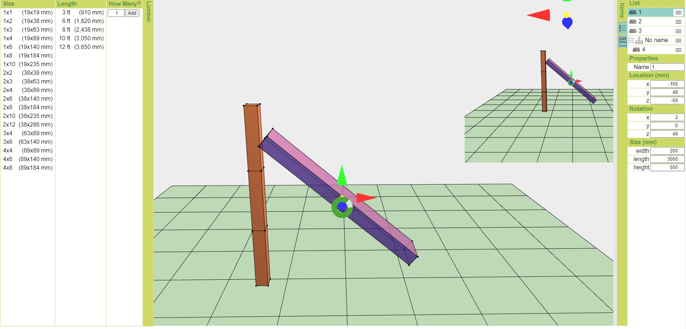
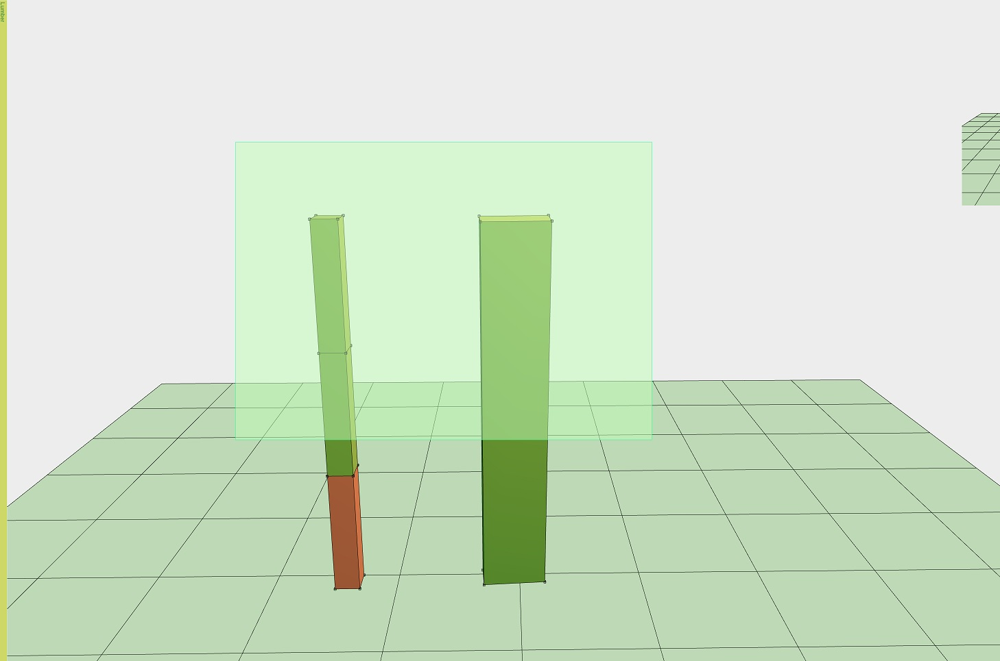

# For DIY lovers

Although this website is planned to help people making a blueprint of DIY stuff for DIY lovers, it is still very much in its early stage. I used to work on this project in my free time but I have not had that much time for the last few years and I do not think I can keep working on it so I decided to make this project public and leave it on GitHub.





## Installation

Get node modules with [diy/src/package.json](./src/package.json). Also I use webpack to bundle client side JavaScript code, see [diy/src/build/webpack.conf.js](./src/build/webpack.conf.js).

## Launch the website

Run the following command.

```bash
node diy/src/bin/www
```
Then, access `http://localhost:3000/index`.

## Features

* Select an item - Left Mouse Click
* Select multiple items - Drag Left Mouse
* Select each item - Left Mouse Click with Control
* Rotate a camera - Drag Right Mouse
* Zoom - Middle Mouse
* Move Left/Right a camera - Middle Mouse with Control
* Move Up/Down a camera - Middle Mouse with Shift
* Add items - Click an add button in a left pane after 
* Select an item via a right pane list 
* Move an item along its axis - Select an item and hold one of its cone and drag it
* Rotate an item along its axis - Select an item and hold one of its cone and drag it with holding shift

## Description

I use [lightgl.js](./src/vuejs/lib/lightgl.js) to handle low level WebGL stuff. Also lightgl.js supports Constructive Solid Geometry (CSG), see [csg.js](./src/vuejs/lib/csg.js). 

## License
[MIT](https://choosealicense.com/licenses/mit/)
